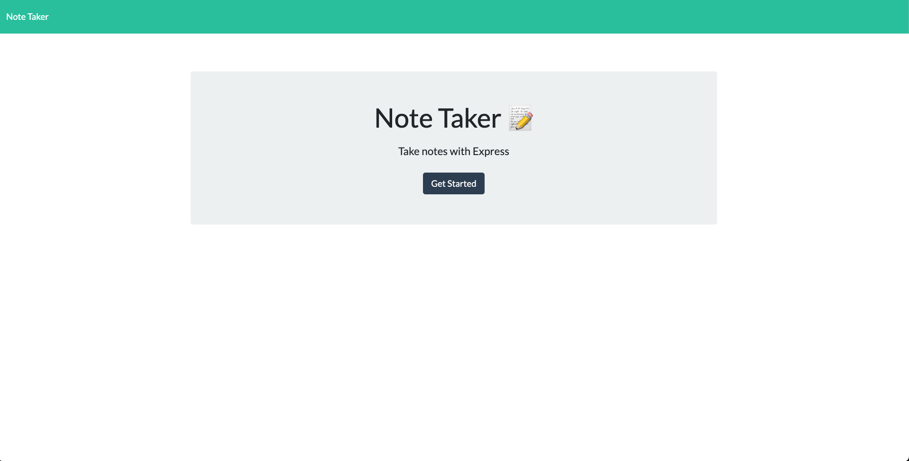
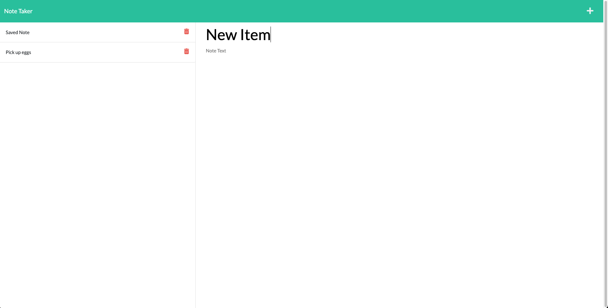

# Note-Taker

Note taking app built in Node.js using Express

<b>Deployed on Heroku:</b> https://serene-stream-25003.herokuapp.com/

## Features

- Ability to add, remove, and view notes.
- Persistant storage via json file in back end

## Tech used

- ExpressJS
- NodeJS

## Preview

### Splash Screen

### Note Screen

